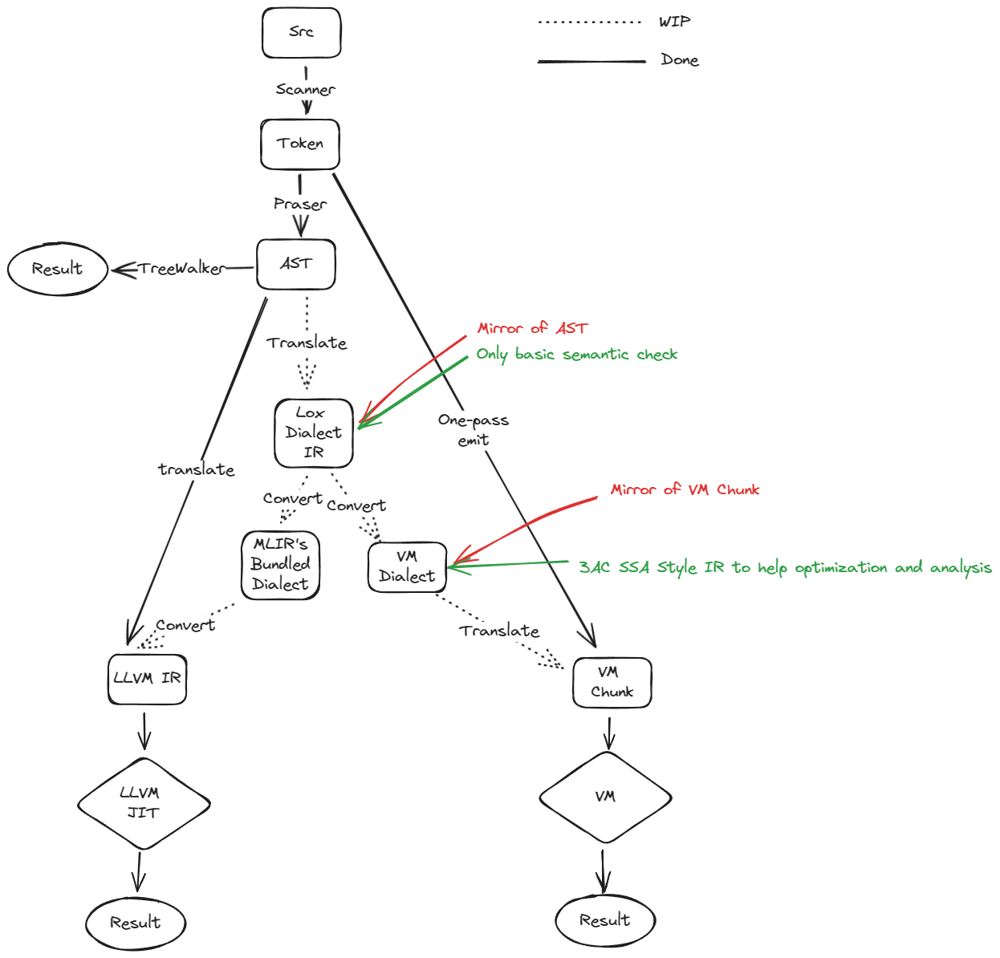

# cppLox

This repo is a cpp Lox interpreter of Lox Language from [Crafting Interpreters](https://craftinginterpreters.com/)

Hope this will be a useful one I would use in future.

There are (will be) four versions of Lox interpreter, they all share a same frontend, and has their own backend.

1. Frontend contains:
    - [x] A scanner to build tokens from raw code.
    - [x] A RD Parser.
    - [x] A Pratt Parser.
    - [x] An AST definition with a simple AST generation tool.

2. Backend contains:
    - [x] A naive tree-walker interpreter, like the jlox, it runs directly on the AST from frontend.
    - [x] A virtual machine interpreter, like the clox, this one uses only scanner from frontend, and do a
      "Pratt Parsing" style one pass compilation, which convert tokens to bytecode directly.
    - [ ] WIP: A LLVM based JIT interpreter, Lox will be a static language with this backend.
      The LLVM backend will translate lox AST to LLVM IR , and then leverage the LLVM Optimization/JIT utilities
      to do a JIT run.
    - [ ] WIP: A MLIR based JIT interpreter, like the LLVM one, but this backend will first translate lox AST to lox
      dialect, then lowering to LLVM dialect using MLIR's multi-level lowering strategy.

3. An illustration of the project's architecture:

   

# What's the difference ?

1. Pure C++ implementation.
    * No need to learn java things.
    * Because the jlox and clox are both wrote in same language, their implementation shares a lot of code,like GC
      system,
      lexer, parser, and so on ,which make transition from jlox to clox much easier.
2. A more clear implementation, code is (hopefully) more readable.
    * Especially true when comparing with original clox's c style code.
    * To write some clean code, it is intended to write some code in a not so efficient/well-designed way. e.g. The
      original
      clox uses a function map to dispatch the codegen-call, which make the implementation more structure, but at here,
      the dispatch is done by a plain switch-case, which is more easy to understand.
3. Files/Modules are well organized, which may help you understand the relationship between each module easier.
4. More language features (Virtual-Machine backend only support `break/continue`):
    * `break/continue` in loops.
    * Comma expression`a,b,c,d`, `[a,b,c,d]` style list expression and `a[i]` style element indexing.
    * Builtin `Tensor`(n-dimension dense matrix) support.
    * Optional python style type hint (used by the jit backend),
      e.g., `var a:float = 3;`, `fun bool add(x:float , y:float)`
5. Help you to learn LLVM/MLIR in a better toy.

# More about JIT

* The MLIR backends is intended to be a tutorial too, the initial implementation is basically a copy
  of [MLIR Toy Tutorial](https://mlir.llvm.org/docs/Tutorials/Toy), check the commit `4b2f652b` to see a how the Toy is
  implemented in Lox

* [jit_notes.md](jit_notes.md) may give you more info.

# About the HardStone branch

The hardstone branch is a more engineering-oriented branch, which will try to make the Lox implementation more robust.

Roadmap:

- [ ] Add more utils like StringRef/Location to make the code more structured.
- [ ] Remove the one-pass bytecode emission compiler, create a simple VM ByteCode IR, add things like LLVM
  Module/Function/BB/Inst, to make the VM bytecode generation
  process more clear. The one-pass compiler is very educational, and also is a dancing with shackles on, you need to
  handle a lot of delicate code to make the compiler work, but I don't think you will be
  happy to maintain the code with shackles on in a long run.
- [ ] Add more infra to make analysis/rewrite easier to implement.
- [ ] Add some canonicalization pass to desugar some syntax-sugar, e.g., `a += b` to `a = a + b`, `var a;`
  to `var a = nil;`, this should make both the IR and the codegen more clear.
- [ ] Add basic constant folding / propagating and CSE/DCE support.
- [ ] Add more stand-alone semantic check/verify pass, to split all the semantic check logic from the codegen and
  parsing logic. When mixing codegen and semantic check, the codegen will be more noisy, and the semantic check logic
  will be hard to maintain.
- [ ] speed up intra-module global var, method and attribute lookup by using some compilation time index.
- [ ] ref-count / tracing mixed GC, to reduce the tracing GC's pause time.
- [ ] Add some bytecode cache to speed up the VM's startup time. (things like `__pycache__` in python). It will also
  help you to separate the compilation and execution time more clearly. In the original clox implementation, some
  values (especially objects) that will be used at runtime are created at compilation time, which is somehow confusing.
- [ ] Add multi-module support, and a simple python style module `import module.full.name as foo` builtin
- [ ] remove most uint8_t related size limitation.
- [ ] add basic IO support, mainly open/read/write/close file, since the stdout/stderr is file too, this should be
  enough for most cases. with this support, we can add a user defined `print` function.
- [ ] add support for "copy capture" and "reference capture".
- [ ] add `del`, `set_attr` `get_attr` support, to make the language more powerful.
- [ ] add a `this` argument implicitly when compiling a method, to avoid using stack hack to access the `this` object.

# Requirements

## For Buiding

* A C++20 compiler is all you need. GCC >= 10.0 or clang >= 10.0 sould be fine,
  check [cppreference](https://en.cppreference.com/w/cpp/compiler_support/20) to see more.
* [Optional] Prebuild LLVM, only used for LLVM/MLIR backend.
    * For LLVM is a huge project to download/build, when JIT backend is not enabled, llvm project will not be
      needed.
    * If you want to build with the JIT backend, run the `third_party/prepare_mlir.sh` to download/prebuild llvm.

## For Testing

If you want to run the test cases in native environment, [dart-sdk](https://dart.dev/tools/sdk) is required.
If you had docker installed, there is a all-in-one script to launch test with docker.

# Build

```bash
git clone https://github.com/edimetia3d/cppLox.git --recursive
cd cppLox
mkdir build
cmake ..
make
```

## CMAKE Options

1. `-DUPSTREAM_STYLE_ERROR_MSG=ON`. This impl's parsing(compiling)/err-handling logic is a little different from
   upstream. Enable this flag will make error messages behaves like upstream. It is OFF by default, but for the unit
   tests, it is set to ON.
2. `-DENABLE_JIT_BACKEND=ON`. Enable the JIT backend, OFF by default. Note that you may need to prebuild LLVM
   to use this option (See Requirements part).
3. `-DLLVM_EXTERNAL_LIT=/path/to/lit`. Only used when ENABLE_JIT_BACKEND is ON. When set, lit tests will be enabled.

# Test

This project leverages test from [Crafting Interpreters GitHub](https://github.com/munificent/craftinginterpreters),
To launch the test, you can use either docker or native machine.

1. If you have docker, just launch the script `./test/launch_unittest_with_docker.sh`
2. If you want to run the test in native machine, you can launch the `./test/unittest.sh`

Note that: a folder test/test_cache will be created to store all the temporary files, which contains:

1. The c++ build files.
2. The dart dependency files.
3. A shallow clone of Crafting Interpreters that stores all the test cases.
